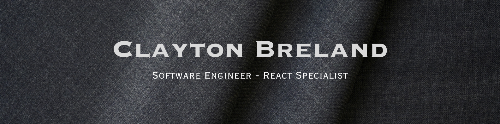

Hi, I'm Clayton Breland. 
     
👨🏽‍💻 Enthusiastic software developer and former U.S. fighter jet maintenance technician  
🖥️ Building a SaaS product for car dealerships at Chrome Lot  
🌱 Creating a side project, [Brela Exams](https://brela-exams.vercel.app/),  where users can create an exam with a simple prompt using the OpenAi API 
  
 
     
<h2 align="center">Languages and Technologies</h2>

    
    
    
    
    
    
     
    
    
    

 

  
  

<!-- shields.io badge styles:   flat (default), flat-square, plastic, for-the-badge -->

<!-- 
  
 -->
 
 
  

<!-- ## Projects:
<table bordercolor="#66b2b2">

  <tr>
    <td width="50%" valign="top">
      <h3 align="center">first</h3>
         
        
         
        

  
  
      

        
<strong>HTML, CSS, JavaScript</strong> - Tag line here!

    </td>
    <td width="50%" valign="top">
      <h3 align="center">next</h3>
         
      
         
        

  
      

        
<strong>HTML, CSS, JavaScript</strong> - Tag line here!

    </td>
  </tr>
</table> -->

</section>
  

   

<h4>GitHub Stats</h4>

<!-- 

&nbsp;
 -->

